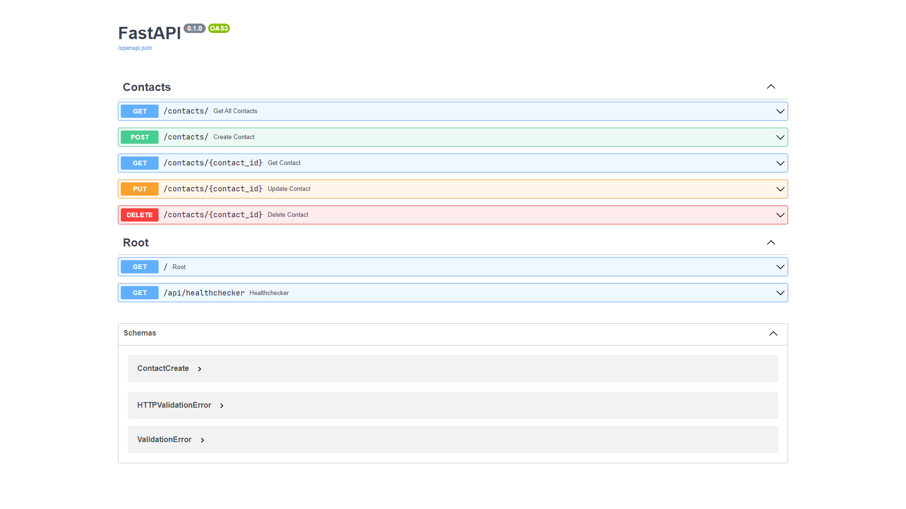
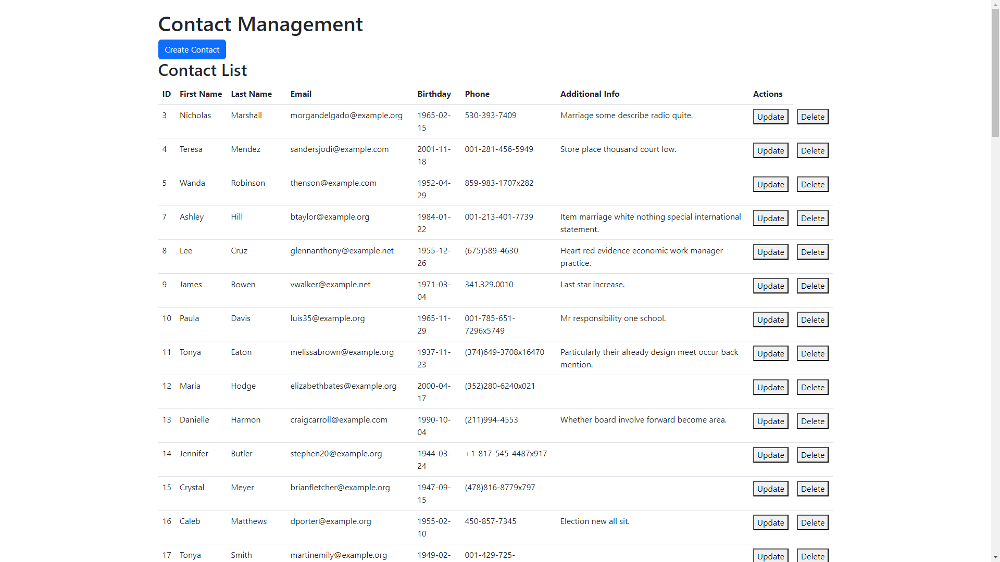

# Домашнє завдання #11

Створення REST API для зберігання та управління контактами за допомогою FastAPI та використовувати SQLAlchemy для управління базою даних.

## Вигляд проекту



## Клієнтська частина



## Установка проекту

Для управління залежностями проекту використовується `pipenv`. Необхідно встановити `pipenv` перед виконанням наступних кроків:

- Склонируйте репозиторий:

  ```shell
  git clone https://github.com/sergiokapone/goit_python_web_hw11.git
  ```

- Для встановлення залежностей використайте команду `pipenv install` або `pipenv sync`.

## Структура проєкту

```shell
.
├── .gitignore
├── alembic.ini
├── Pipfile
├── Pipfile.lock
├── README.md
├── runserver.cmd
├── migrations
│   ├── env.py
│   ├── README
│   └── script.py.mako
│   └── versions
│       └── 11f50bd0a676_create_contacts_table.py
└── src
    ├── main.py
    ├── schemas.py
    ├── database
    │   ├── config.ini
    │   ├── connect.py
    │   ├── models.py
    │   └── __init__.py
    ├── routes
    │   ├── contacts.py
    │   └── __init__.py
    └── utils
        ├── fake_contacts_create.py
        └── __init__.py
```

## Запуск сервера

Для запуску сервера введіть в віртуальному оточенні команду

```shell
runserver
```

або

```shell
uvicorn src.main:app --host localhost --port 8000 --reload
```

Після успішного запуску сервера, встановиться зв'язок з базою даник.

## Використанні API

Дані зберігаються у хмарній базі даних [ElephantSQL](https://www.elephantsql.com/).

API додатку надає можливість виконувати наступні операції з контактами:

### Отримання списку контактів

- URL: `/contacts`
- Метод: `GET`
- Опис: Отримання списку всіх контактів.

### Отримання даних контакту

- URL: `/contacts/{contact_id}`
- Метод: `GET`
- Опис: Отримання даних конкретного контакту за його ідентифікатором (contact_id).

### Створення нового контакту

- URL: `/contacts`
- Метод: `POST`
- Опис: Створення нового контакту з наданими даними.

Приклад тіла запиту (JSON):

```json
{
  "first_name": "Sergiy",
  "last_name": "Ponomarenko",
  "phone_number": "0978786754",
  "email": "my@e.mail",
  "birthday": "1978-12-12",
  "additional_data": "no",
}
```

### Оновлення даних контакту

- URL: `/contacts/{contact_id}`
- Метод: PUT
- Опис: Оновлення даних конкретного контакту за його ідентифікатором `(contact_id)`.

### Видалення контакту

- URL: `/contacts/{contact_id}`
- Метод: `DELETE`
- Опис: Видалення конкретного контакту за його ідентифікатором `(contact_id)`.

### Пошук контактів

- URL: `/contacts/search`
- Метод `GET`
- Опис: Шукає контакти за заданими параметрами пошуку.

### Отримання контактів з найближчими днями народження

- URL: `/birthdays/`
- Метод `GET`
- Опис: Повертає список контактів з наближаються днями народження.

## Використання клієнта для обробки запитів

Додатково був розроблений клієнт на `js` для взаємодії з REST API. Він надає зручний спосіб відображення та керування контактами.

Клієнт доступний за адресою [https://sergiokapone.github.io/goit_python_web_hw11](https://sergiokapone.github.io/goit_python_web_hw11)
